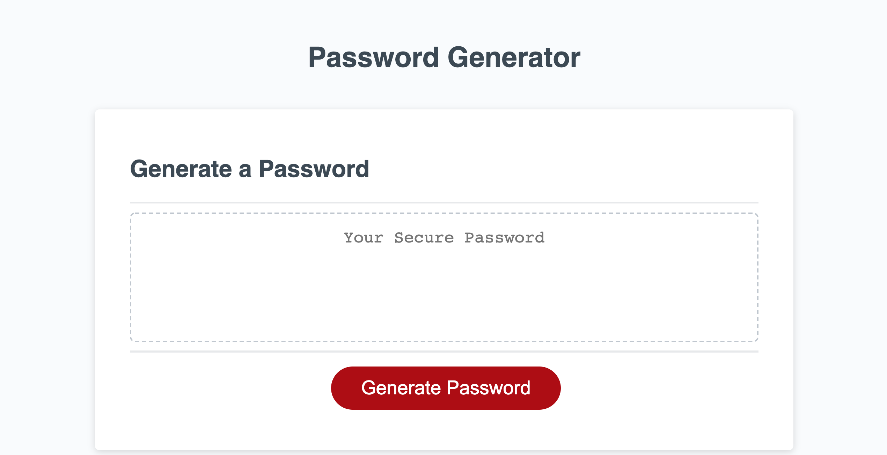
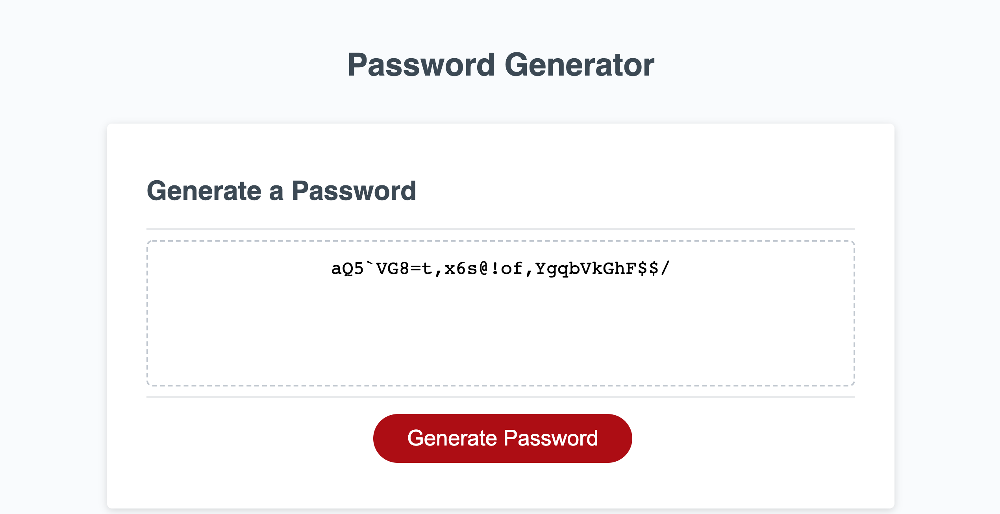

# Password Generator

## Purpose

A tool that generates a random password after gather input from the user pertaining to password length (min = 8, max = 128), and which character-types they would like to include (uppercase, lowercase, special, numeric).

## Table of Contents
- [Built With](#built-with)
- [Website](#website)
- [Installation](#installation)
- [Usage](#usage)
- [Contribution](#contribution)
- [License](#license)

## Built With

* HTML
* CSS
* JavaScript

## Website

https://nsvoboda.github.io/password-generator/

### Installation

It is best practice to directly clone the respository by using the following code in your Terminal/Command Line:

git clone git@github.com:nsvoboda/password-generator.git

You can also download the files into a .zip directly from the GitHub repository.

### Usage

Generate a secure password that meets any requirements you have based on allowed character type or limitations (as long as they are within the parameters of min=8 characters, max=128 characters).

## Contribution
Edited with ❤️ by Nate.

## License

&copy; 2021 Nathaniel Svoboda

Licensed under the [BSD 2-Clause](LICENSE.txt)